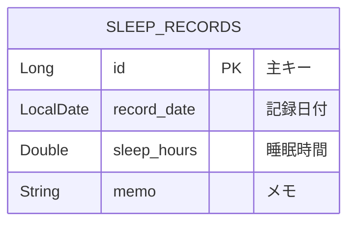
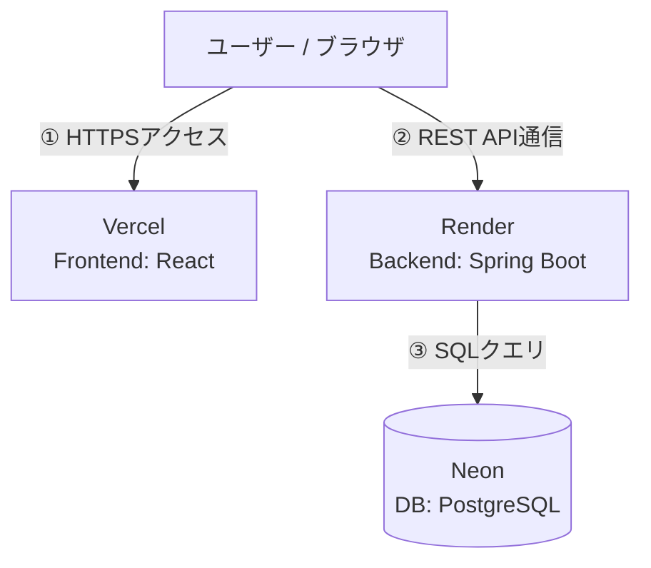

# 睡眠記録アプリ

**日々の睡眠時間を可視化し、健康的な生活習慣の形成をサポートするWebサービス**

---

## サービス概要
毎日の睡眠時間や体調メモを簡単に記録・管理できるアプリケーションです。直感的な操作で過去の記録を可視化し、自身の睡眠習慣の振り返りをサポートします。

---

## 本番環境 URL
- **アプリURL**: [https://sleep-tracker-frontend-seven.vercel.app]
- **テスト用アカウント**: 不要（直接ご利用いただけます）

---

## 開発背景・目的
自身の生活習慣を見直す中で、日々の睡眠時間や体調の変化をシンプルに記録できるツールが必要だと考え開発しました。
余計な機能を削ぎ落とし、「記録のしやすさ」と「視覚的なわかりやすさ」に特化したUI/UXを意識して実装しています。

---

## 主要機能
| 機能 | 概要 |
| --- | --- |
| **睡眠記録の登録** | 日付、睡眠時間（時間単位）、メモを入力して保存 |
| **体調アドバイス表示** | 睡眠時間に応じた注意喚起メッセージの動的表示 |
| **記録一覧表示** | 過去に登録した睡眠データの確認 |

---

## 使用技術（技術スタック）

| カテゴリ | 技術・ツール |
| --- | --- |
| **Frontend** | React, JavaScript, HTML5, CSS3 |
| **Backend** | Java, Spring Boot, Spring Data JPA |
| **Database** | PostgreSQL (Neon) |
| **Hosting / Deploy** | Vercel (Frontend), Render (Backend) |
| **Version Control** | Git, GitHub, GitHub Desktop |

---

## ER図（データベース設計）

## インフラ構成図

